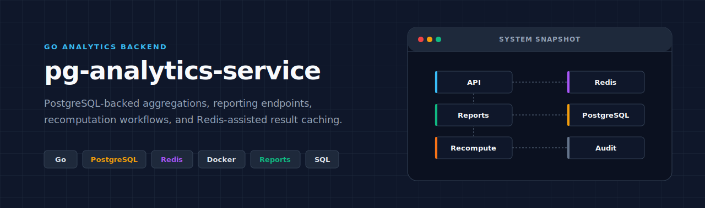
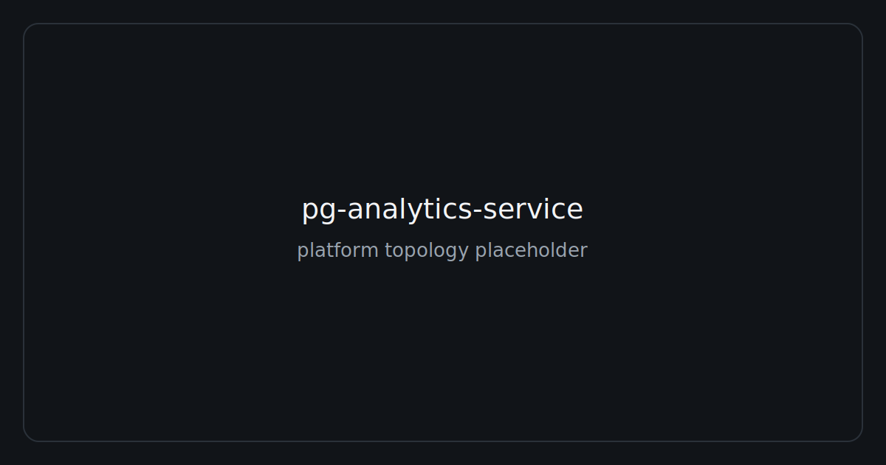
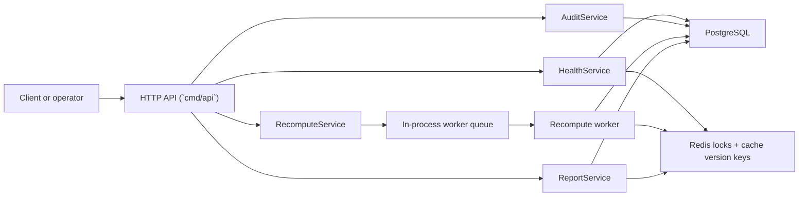
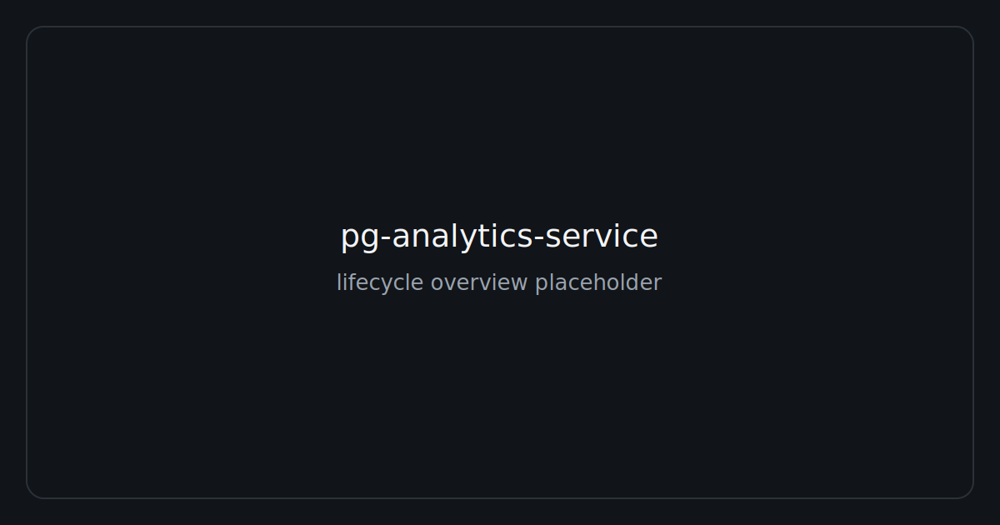
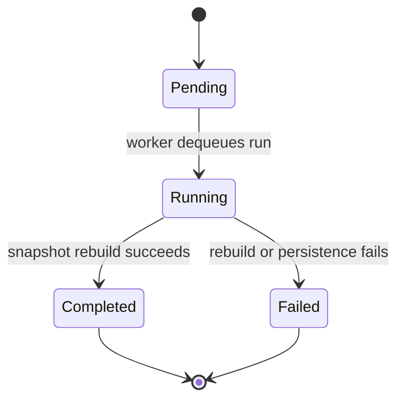
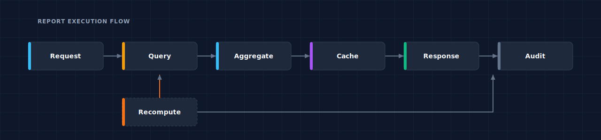

# pg-analytics-service

**PostgreSQL-first analytics API for report execution, recomputation, and auditable operational workflows.**



`pg-analytics-service` is a Go backend that turns raw event data into a clean analytics surface: report definitions live in PostgreSQL, report reads come from snapshot tables, recomputation runs are explicit and traceable, and Redis is used only where it improves latency or protects operational workflows.

## Quick Navigation

- [Why This Repository Matters](#why-this-repository-matters)
- [Architecture Overview](#architecture-overview)
- [Report Model and Lifecycle](#report-model-and-lifecycle)
- [Capability Matrix](#capability-matrix)
- [API Overview](#api-overview)
- [Data and Query Strategy](#data-and-query-strategy)
- [Local Workflow](#local-workflow)
- [Validation and Quality](#validation-and-quality)
- [Repository Structure](#repository-structure)
- [Docs Map](#docs-map)
- [Scope Boundaries](#scope-boundaries)
- [Future Improvements](#future-improvements)

## Why This Repository Matters

This repository is meant to read like a serious backend and data-service implementation, not a thin reporting demo. The value is in the combination of clear SQL-based analytics, bounded recomputation workflows, versioned caching, operational auditability, and a local workflow that still feels production-minded.

What makes it stronger than a simple reporting API:

- Analytics logic stays reviewable in PostgreSQL instead of disappearing behind opaque pipeline tooling.
- Read APIs are backed by precomputed snapshot tables rather than expensive raw-event queries on every request.
- Recomputation is explicit, lock-protected, asynchronous, and persisted as first-class operational state.
- Cache invalidation is deliberate and deterministic through per-report version bumps instead of key-scan deletion.
- The repository shows engineering discipline across HTTP boundaries, local Docker workflow, testing, CI, and deployment notes.

## Architecture Overview



The service is intentionally compact: one API process, one PostgreSQL database, and one Redis instance. That simplicity is deliberate. PostgreSQL owns analytical truth and operational history, while Redis is scoped to response caching and duplicate-trigger protection.



| Runtime area | Current responsibility |
| --- | --- |
| API server | Serves `/api/v1`, validates inputs, applies management auth, and returns consistent JSON envelopes. |
| Report execution | Reads `report_definitions`, validates date/window inputs, queries `metric_snapshots`, and uses Redis for cached responses. |
| Recomputation runs | Acquires a Redis scope lock, creates `recompute_runs`, executes report-specific rebuild SQL asynchronously, and writes summaries back to PostgreSQL. |
| PostgreSQL | Stores raw events, report metadata, snapshot aggregates, recompute history, and audit entries. |
| Redis | Stores versioned report-response cache entries and short-lived recompute locks. |
| Audit trail | Persists `recompute.triggered`, `recompute.completed`, and `recompute.failed` events in `audit_entries`. |

More detail: [Architecture Notes](docs/architecture.md)

## Report Model and Lifecycle



The reporting layer is built around a small set of durable records. Report definitions describe what can be queried, aggregate windows describe valid bucket sizes, metric snapshots hold read-optimized results, recompute runs track operational execution, and audit entries preserve who triggered what.

| Artifact | Why it exists | Implemented behavior |
| --- | --- | --- |
| `report_definitions` | Public report catalog | Three seeded report types with description, cache TTL, default window, and supported filter metadata. |
| `aggregate_windows` | Allowed aggregation windows | `day` and `week` rows per report, including retention and refresh metadata. |
| `metric_snapshots` | Read-optimized analytics store | One row per report, window, bucket, dimension, and metric, optionally linked to the recompute run that produced it. |
| `recompute_runs` | Operational execution record | Tracks `pending`, `running`, `completed`, and `failed` states plus summary and error details. |
| `audit_entries` | Operational trail | Records recompute lifecycle events with actor and metadata. |

| Report | Effective query shape | Typical use |
| --- | --- | --- |
| `volume-by-period` | Period totals by default, or period plus `source` when `breakdown=source` | Trend analysis and source-level volume shifts |
| `status-counts` | Totals by status by default, or period plus status when `breakdown=period` | Outcome distribution and drift over time |
| `top-entities` | Entity ranking over a bounded range | High-volume actor analysis |



More detail: [Domain Model](docs/domain-model.md)

## Capability Matrix

| Capability | Current implementation |
| --- | --- |
| Report listing | Public `GET /api/v1/reports` catalog with search, pagination, and allowlisted sorting from `report_definitions`. |
| Report execution | `GET /api/v1/reports/{slug}/run` reads precomputed `metric_snapshots` and returns execution metadata. |
| Grouped metrics | Source, status, period, and entity groupings are implemented through report-specific snapshot queries. |
| Recomputation | Management-only `POST /api/v1/recomputations` creates a run record and pushes work to an in-process queue. |
| Caching | Redis stores versioned report responses keyed by normalized query parameters and per-report cache version. |
| Locking | Redis `SETNX`-style locks prevent duplicate recompute triggers for the same report/window/date scope. |
| Management auth | `X-Management-Key` or `Authorization: Bearer <key>` protects recomputation and audit endpoints. |
| Audit logging | PostgreSQL `audit_entries` records recompute trigger, completion, and failure events. |
| Docker workflow | Docker Compose provisions API, PostgreSQL, and Redis with auto-migrate and auto-seed for local use. |
| Tests, lint, and CI | Go tests, `golangci-lint`, build checks, format validation, and `docker compose config` run in CI. |

## API Overview

The README stays at the endpoint-family level so the main story remains architectural and operational. The full request and response details live in the docs.

| Endpoint family | Routes | Purpose |
| --- | --- | --- |
| Health | `GET /api/v1/health` | Dependency-aware health status for PostgreSQL and Redis. |
| Report catalog | `GET /api/v1/reports`, `GET /api/v1/reports/{slug}` | Discover available report definitions and filter metadata. |
| Report execution | `GET /api/v1/reports/{slug}/run` | Query snapshot-backed analytics results. |
| Recomputation | `POST /api/v1/recomputations`, `GET /api/v1/recomputations/{id}` | Trigger and inspect asynchronous snapshot rebuilds. |
| Audit | `GET /api/v1/audit-entries` | Review management actions and worker outcomes. |

API detail: [API Overview](docs/api-overview.md)

## Data and Query Strategy



PostgreSQL is the center of the design. Raw events, report catalog metadata, read-optimized snapshots, recompute runs, and audit entries all live in one durable system. That keeps the analytical model and the operational model close enough to review together.

| Concern | Implementation |
| --- | --- |
| Raw input | `analytics_events` stores timestamped events with source, status, entity, and payload fields. |
| Report catalog | `report_definitions` and `aggregate_windows` define what reports exist and which bucket sizes are valid. |
| Read path | `metric_snapshots` stores pre-aggregated `event_count` values keyed by report, window, bucket, and dimension. |
| Operational state | `recompute_runs` and `audit_entries` persist lifecycle and operator history. |
| Cache strategy | Redis stores serialized report results under `report:{slug}:v{version}:{params_hash}`. |
| Invalidation strategy | Recompute completion increments `report:version:{slug}`, which retires old cache generations without scanning keys. |

The main query patterns are intentionally explicit:

- Recomputation scans `analytics_events` by time range, then groups with `date_trunc('day'|'week', occurred_at)` into snapshot buckets.
- Report reads query `metric_snapshots` through lookup and dimension indexes instead of aggregating raw events on demand.
- Operational reads use indexed `recompute_runs` and `audit_entries` tables so status and audit lookups stay cheap.
- Redis is not a source of truth; if it is unavailable, durable analytical state remains in PostgreSQL.

## Local Workflow

The local workflow is Docker-first. The compose stack gives you the same moving parts the service expects in production-like environments, without requiring external infrastructure.

1. Create the environment file.

```sh
cp .env.example .env
```

2. Start the stack.

```sh
docker compose up --build
```

3. Verify the service.

```sh
curl http://localhost:3004/api/v1/health
```

4. Run a report and trigger a recompute.

```sh
curl "http://localhost:3004/api/v1/reports/status-counts/run?window=day&date_from=2026-01-01&date_to=2026-02-01"

curl -X POST http://localhost:3004/api/v1/recomputations \
  -H "Content-Type: application/json" \
  -H "X-Management-Key: local-management-key" \
  -d '{
    "report_slug": "status-counts",
    "window": "day",
    "date_from": "2026-01-01",
    "date_to": "2026-02-01",
    "requested_by": "local-operator"
  }'
```

When `docker compose up --build` uses the default `.env`, the app container automatically:

- applies SQL migrations
- seeds 25,000 demo events if `analytics_events` is empty
- precomputes day and week snapshots for all seeded reports

Shortcut commands are available through `make`: `make up`, `make down`, `make logs`, `make migrate`, `make seed`, `make test`, `make lint`, and `make build`.

More detail: [Local Development](docs/local-development.md)

## Validation and Quality

| Check | Command | Notes |
| --- | --- | --- |
| Format | `gofmt -l $(find . -name '*.go' -not -path './vendor/*')` | Mirrors the formatting gate in CI. |
| Lint | `make lint` | Runs `golangci-lint` inside the compose-based app environment. |
| Tests | `make test` or `go test ./... -count=1` | Integration tests expect PostgreSQL on `5436` and Redis on `6383`. |
| Build | `make build` or `go build ./...` | Verifies the service compiles cleanly. |
| Compose validation | `docker compose config` | Included in CI to catch invalid environment or compose changes. |
| Runtime check | `curl http://localhost:3004/api/v1/health` | Confirms the HTTP process and both dependencies are reachable. |

CI reference: [.github/workflows/ci.yml](.github/workflows/ci.yml)

## Repository Structure

```text
.
|-- .github/
|   `-- workflows/
|       `-- ci.yml
|-- assets/
|   `-- readme/
|-- cmd/
|   |-- api/
|   |-- migrate/
|   `-- seed/
|-- docker/
|   `-- go/
|-- docs/
|-- internal/
|   |-- application/
|   |-- domain/
|   |-- http/
|   `-- infrastructure/
|       |-- config/
|       |-- postgres/
|       `-- redis/
|-- tests/
|   |-- integration/
|   `-- testutil/
|-- docker-compose.yml
`-- Makefile
```

## Docs Map

| Document | Focus |
| --- | --- |
| [README.md](README.md) | Reviewer-facing project overview, architecture story, and local workflow. |
| [docs/architecture.md](docs/architecture.md) | Runtime component boundaries, request flow, and design trade-offs. |
| [docs/domain-model.md](docs/domain-model.md) | Core data model, report catalog, snapshot lineage, and recompute lifecycle. |
| [docs/api-overview.md](docs/api-overview.md) | Endpoint families, parameter behavior, envelopes, auth, and error mapping. |
| [docs/security.md](docs/security.md) | Implemented controls, management auth model, and hardening guidance. |
| [docs/local-development.md](docs/local-development.md) | Docker-first setup, commands, sample requests, and troubleshooting. |
| [docs/deployment-notes.md](docs/deployment-notes.md) | Runtime image, config, scaling notes, and deployment trade-offs. |
| [docs/roadmap.md](docs/roadmap.md) | Realistic next steps without overstating current capability. |

## Scope Boundaries

The current scope is intentionally tight. This repository is designed to show a mature analytics backend shape without pretending to be a full data platform.

| Boundary | Current position |
| --- | --- |
| Recompute triggering | Manual and management-only through HTTP. No scheduler is implemented yet. |
| Queue durability | In-process channel only. Queued work does not survive API restarts. |
| Security model | Single management API key for protected routes. No tenant or user-level auth model is implemented. |
| Analytics breadth | Three concrete report types are implemented to demonstrate the pattern without adding fake surface area. |
| Cache behavior | Versioned response caching is implemented; cache warmup and adaptive cache policy are not. |
| Multi-service orchestration | The service stays local-first and self-contained. External brokers and workflow engines are roadmap items, not current behavior. |

## Future Improvements

The next improvements are clear, but they remain future work until implemented:

| Area | Likely next step |
| --- | --- |
| Durability | Replace the in-process recompute queue with an external durable worker system. |
| Scheduling | Add scheduled recompute plans per report and window. |
| Contracts | Publish an OpenAPI description and add contract-oriented API tests. |
| Observability | Add metrics, richer structured logs, and trace-friendly instrumentation. |
| Access control | Introduce tenant-aware authorization and more granular management scopes. |

Roadmap detail: [docs/roadmap.md](docs/roadmap.md)
