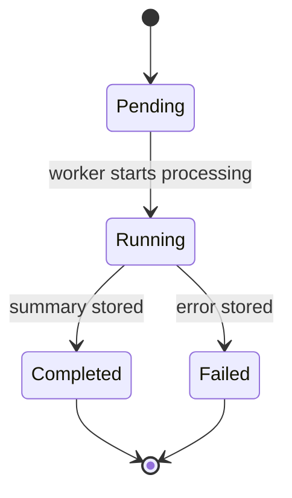

# Domain Model

The domain model is intentionally small and practical. The service keeps raw events, report metadata, read-optimized snapshots, recompute execution state, and audit history in a shape that is easy to inspect from both code and SQL.

## Related Docs

- [README](../README.md)
- [Architecture](architecture.md)
- [API Overview](api-overview.md)

## Core Objects

| Object | Backing table | Purpose | Key fields |
| --- | --- | --- | --- |
| Event source | `event_sources` | Catalogs upstream providers represented in seeded analytics data | `slug`, `provider_name`, `description`, `is_active` |
| Analytics event | `analytics_events` | Stores raw event records that recomputation reads from | `source_id`, `entity_id`, `status`, `processing_ms`, `amount_cents`, `occurred_at`, `payload` |
| Report definition | `report_definitions` | Describes the public report catalog | `slug`, `name`, `description`, `cache_ttl_seconds`, `default_window`, `supported_filters` |
| Aggregate window | `aggregate_windows` | Describes allowed windows and operational metadata per report | `window_name`, `retention_days`, `refresh_interval_minutes`, `is_default` |
| Metric snapshot | `metric_snapshots` | Stores precomputed analytics rows used by report endpoints | `report_slug`, `window_name`, `bucket_start`, `dimension_key`, `dimension_value`, `metric_name`, `metric_value`, `run_id` |
| Recompute run | `recompute_runs` | Tracks the execution lifecycle of a manual snapshot rebuild | `status`, `date_from`, `date_to`, `requested_by`, `summary`, `error_message` |
| Audit entry | `audit_entries` | Persists operational activity for management endpoints and worker outcomes | `actor`, `action`, `resource_type`, `resource_id`, `metadata`, `created_at` |

## Report Catalog

All current reports are backed by the same `metric_snapshots` table. What changes by report is the dimension being aggregated and the query shape exposed by the API.

| Report slug | Snapshot dimension | Effective API behavior | Supported windows |
| --- | --- | --- | --- |
| `volume-by-period` | `source` | Omit `breakdown` or use `period` for period totals; use `breakdown=source` for period plus source rows; optional `source` filter narrows the dimension | `day`, `week` |
| `status-counts` | `status` | Omit `breakdown` or use `status` for totals by status; use `breakdown=period` for period plus status rows; optional `status` filter narrows the dimension | `day`, `week` |
| `top-entities` | `entity_id` | Returns ranked entities over the requested range with `limit` and `offset` pagination | `day`, `week` |

## Snapshot Lineage

```mermaid
flowchart LR
    Definitions["`report_definitions` + `aggregate_windows`"] --> Recompute["Recompute SQL"]
    Events["`analytics_events`"] --> Recompute
    Recompute --> Snapshots["`metric_snapshots`"]
    Recompute --> Runs["`recompute_runs`"]
    Recompute --> Audit["`audit_entries`"]
    Snapshots --> ReportAPI["`GET /reports/{slug}/run`"]
```

`run_id` on `metric_snapshots` creates lineage between the materialized rows and the recompute execution that generated them.

## Recompute Run Lifecycle



The current lifecycle states are:

- `pending`: the management request passed validation and the run record was created
- `running`: a worker goroutine is actively rebuilding the requested snapshot range
- `completed`: snapshot rebuild finished and summary counts were stored
- `failed`: snapshot rebuild or run finalization failed and the error was recorded

## Modeling Notes

- Snapshot buckets are computed with PostgreSQL `date_trunc`, so daily and weekly windows are aligned in the database rather than in application code.
- `metric_snapshots` enforces uniqueness on `(report_slug, window_name, bucket_start, dimension_key, dimension_value, metric_name)`.
- Recompute deletes and rebuilds only the affected bucket range for the requested report and window.
- Audit metadata is stored as `jsonb`, which keeps operational context flexible without widening the table for every new event detail.
- Seed data creates 25,000 events and then precomputes day and week snapshots for all three reports.
